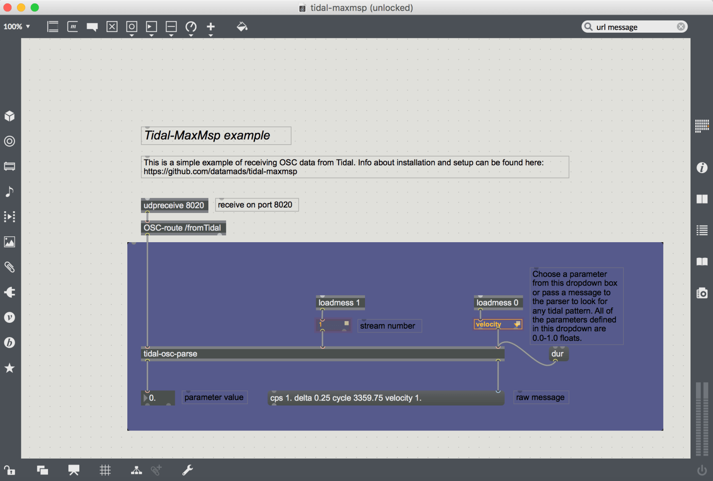

This is a duplicate from the [tidalcycles blog](http://blog.tidalcycles.org/how-to-connect-tidal-to-maxmsp/).

# How to connect Tidal to MaxMSP

Normally, when you open up Tidal and start live coding you are connected to the SuperCollider based synthesizer SuperDirt.

The way the two communicate is through an Open Sound Control (OSC) connection – a handy protocol designed for sending sound-related data over a network (in this instance locally, within your computer).

This means that every time you “play a note” in Tidal you are sending off a bundle of parameter data – note values, duration, current cycle number, etc. – as a neatly organized data package containing all the information necessary for SuperCollider to setup and play a sound.

One of the many fantastic things about this relationship – where Tidal is in charge of the composition process and SuperCollider is in charge of the sound synthesis – is its modularity (and as such: hackability).

Practically, what this means is you can simply unplug Tidal from SuperCollider and plug it in to other environments – any environment, actually, that is able to receive data over OSC. One such environment is the very popular Max MSP.

### Hello Max

Connecting Tidal Cycles and Max MSP is a very rewarding way of harnessing the power of Tidal’s pattern system to explore the immense possibilities of Max MSP. Using this method, you can set up Tidal patterns to control visuals made in Jitter, manipulate a Max MSP based synthesis engine / instrument or funnel the data to Max4Live (which I will show to do later on).

To get up and running, [I have made a simple setup which can be downloaded from Github](https://github.com/datamads/tidal-maxmsp/). It consists of three things:
1. A Haskell module (called MaxMspOsc) that defines the OSC connection to Max MSP
2. A very simple tidal example ( tidal-maxmsp-example.tidal ) that sends off a pattern of data
3. Max MSP project ( tidal-maxmsp.maxproj ) with a simple patch receiving the data from Tidal.

### Inside the max patch

Once everything is installed, you should open up the tidal-maxmsp.maxproj. This is where you will receive the OSC data. Any of the standard tidal parameters are available as well as a few extra parameters defined in the MaxMspOsc module (see the dropdown on the right side of the patch which contains all of these custom parameters which are all float values of 0.0 to 1.0 for consistency’s sake).

At the top of the patch is a udpreceive object which is the network object that will receive the OSC data from tidal. It has one parameter defined, the port number, which is set to 8020 both here and in Tidal (you can change it another integer number as long as both Max MSP and Tidal are using the same port number).

Below it is an OSC-route object which looks for any OSC bundles with a url starting with /fromTidal and passes it on to the tidal-osc-parse abstraction.

If you double click the tidal-osc-parse abstraction you will see a small patch which has three inlets. The first is for the raw osc data from the OSC-route object. Inlet 2 receives the stream number (defined in Tidal) and inlet 3 takes the parameter name to look for. It breaks down the OSC message into pairs of parameters / values and looks for the one defined in inlet 3 and spits it out of it’s left outlet (and the raw message without any url at it’s right outlet).

Now, head back to Tidal and open up tidal-maxmsp-example.tidal. At the top of this file you’ll see an import statement for the Haskell module. Evaluate this line – if you don’t get an error, you most probably installed it correctly. Now evaluate `max1 <- maxmspStream “127.0.0.1” 8020 1` and the last line to start sending OSC data.

If you head back to Max you should now see the values of the velocity pattern defined in Tidal now showing up in the float box in the bottom of the patch and all of the raw bundle in the message box.

That’s it!

Try connecting the float box to whatever Max MSP project you have, or if you want: Get more Tidal parameters by copying and pasting everything inside of the purple panel and changing the dropdown or message at the rightmost inlet of the tidal-osc-parse abstraction (and changing the tidal code accordingly).

Now, this is just a basic example which is not super precise in terms of timing. To get more precision we need to add time stamps/tags to make sure everything is played on time but this basic patch should get you started.
