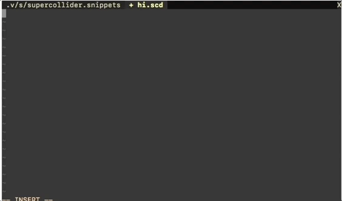

# SuperCollider tutorial: Set up VIM as a SuperCollider IDE

VIM is an extremely popular text editor. And frankly, it's amazing what you can do with it.

Replacing the SuperCollider IDE with VIM is a great way to improve your SuperCollider workflow, especially if you want to write code more effectively, create or maintain larger SuperCollider projects or become a faster live coder. 

The main advantages of using VIM are speed and effectiveness. It's a text editor in the terminal which means you strictly use your keyboard to navigate and use it. And since it's a very common text editor used by a massive world wide community for all sorts of professional programming purposes, it's also well documented and highly extensible via the plugin system and can thus help you make your projects cleaner and easier to navigate (plus, you can use it for any programming language, so if you're writing [Tidal code](https://github.com/munshkr/vim-tidal) for example or want to make a P5JS sketch as part of your project along side your .scd files, etc. etc.). There's a lot of pros of using VIM, a con is that you obviously have to invest a bit of time in learning it but you make up for it in the long run by saving a lot of time once you get better at it.

In a nutshell, you can basically do anything in VIM. 

But getting SuperCollider and SCVIM (the vim plugin that enables SuperCollider support) up and running can be troublesome.

This tutorial is for people who are new to VIM or having trouble getting started using SCVIM. Most of what we are going to do here is happening inside of a terminal. On MacOS you can find the standard terminal by searching for `terminal.app`. 

**A general piece of advice:** Don't just install vim plugins or copy-paste other people's .vimrc files when you're starting out. None of that stuff is useful, unless you take the time to learn a bit about each of them and get used to their functions. It doesn't have to be much, but read (some of) the documentation for each and test them out, see if they fit your workflow and help you.

#### Prequisites:
* [SuperCollider](http://supercollider.github.io/) 
* VIM (MacOS installation (using [brew](https://brew.sh/)): `brew install vim`, linux using apt-get: `sudo apt-get install vim`)
* A terminal
---
### How to quit vim

Vim is a fundamentally different text editor experience compared to more conventional ones where you use a mouse. And as a result, one of the biggest jokes sorrounding VIM is how hard it is for newbies to quit it. So let's just get that out of the way, we wouldn't want you to be ridiculed on your first day in VIM.

In vim's normal mode (press `esc` if you're not sure if you're in normal mode) type the command `:wq` this will write the current buffer to a file and quit vim. Congratulations, you just exited out of VIM. 

### Install Pathogen

[Pathogen](https://github.com/tpope/vim-pathogen) is a plugin manager for VIM. It makes the installation and management of plugins very easy. 

Execute the following terminal command to download and install pathogen in VIM:

`mkdir -p ~/.vim/autoload ~/.vim/bundle && \
curl -LSso ~/.vim/autoload/pathogen.vim https://tpo.pe/pathogen.vim`

After downloading Pathogen you need to activate it in your .vimrc
execute `vim ~/.vimrc` and add the following line: `execute pathogen#infect()`. Save and quite (type the command `:wq` inside of VIM). 

### Install SCVIM
Now it's time to install the [SCVIM](https://github.com/supercollider/scvim) plugin to add support for SuperCollider in VIM.

Note, [Arch Linux users: Having Ruby installed is a prerequisite](https://www.listarc.bham.ac.uk/lists/sc-users/msg61966.html)

`cd ~/.vim/bundle && git clone https://github.com/supercollider/scvim`

A problem when installing SCVim is that it comes with a very important SuperCollider class file called `SCVim.sc`. But it's stowed away in the vim plugin folder where SuperCollider doesn't look for class files.

To solve this, we need to create a symlink so that SuperCollider can find the SCVim class file when it looks through it's extensions directory. 

First we need to find the path to our extensions dir. Open up SuperCollider and execute `Platform.userExtensionDir` and copy the path that it posts to the window. In my case it's `/Users/tutorialmads/Library/Application Support/SuperCollider/Extensions` but yours will be different.

Then, using that path we create the symlink on the command line like so: `ln -s ~/.vim/bundle/scvim/sc "/Users/tutorialmads/Library/Application Support/SuperCollider/Extensions"` – change the second path inside of the quotation marks to whatever SuperCollider gave your as our user extension dir.

Just to be sure, open up SuperCollider and try recompiling the class library. This should happen without errors, otherwise something above went wrong. 

If everything looks alright, quit SuperCollider and open up a .scd file and test if SCVim works: `vim hello.scd`. Then, inside VIM, execute the command `:SClangStart` – this should open a seperate window with a terminal and the interpreter.

Then execute `:SCtags`

### Set up basics in your .vimrc
One of the most fundamental features of VIM is the [.vimrc file](https://dougblack.io/words/a-good-vimrc.html). This is where you remap keys to certain functions, change settings or add features to VIM using vimscript.

Let's open up our .vimrc. Inside of vim, type `:tabnew ~/.vimrc` or in the terminal type `vim ~/.vimrc` and add the following lines:

```
" VIM ESSENTIALS

" Set <leader> to be ,
let mapleader = ","

" Set <localleader> to be .
let maplocalleader="."

" open .vimrc in a new tab by pressing <leader>av
nnoremap <leader>av :tabnew $MYVIMRC<CR>

" Reload vimrc by pressing <leader>rv
nnoremap <leader>rv :source $MYVIMRC<CR>

" SC SPECIFIC
" Find arguments of a class by pressing the semi colon key
au Filetype supercollider nnoremap ; :call SCfindArgs()<CR>

" Activate flashing when a piece of code is evaluated
let g:scFlash = 1
```
source the .vimrc by closing and reopening vim or inside of vim type `:so ~/.vimrc`

### Basic commands

With everything setup you now have a bunch of nice SuperCollider features at your service:

in normal mode:
* Type `K` to open up the help file for the class under the cursor
* Type `;` to quickly look up the arguments for a class under the cursor (this is what we changed in the .vimrc above)
* Type `,sk` to recompile the library (changed in the .vimrc as well)

in normal/insert mode:

* F5 to execute a block of code scvim will attempt to find the outermost bracket
* F6 to execute the current line of code
* F12 is a hard stop

SuperCollider Commands
* Starting SuperCollider from within vim:
`:SClangStart`
* Kill SClang: `:SClangKill`

Other good commands

* `:vsplit <filename>` – edit <filename> in a window split

### Add colors and turn on syntax highlighting

To get syntax highlighting I recommend installing a nice color scheme. My favourites are currently `zenburn` and `preto`.

First, make a directory inside of vim for color schemes, if you haven't already
`mkdir ~/.vim/colors/ && cd ~/.vim/colors/`

Then, still inside the colors directory download a nice color scheme. Let's try zenburn:

`curl https://raw.githubusercontent.com/jnurmine/Zenburn/master/colors/zenburn.vim > zenburn.vim`

Then, add the following lines to your .vimrc and source it again
```
colo zenburn
syntax on
```


### Basic VIM movements

A Vim mantra: Waste as little time possible on using the arrow keys.

That said, learning vim's nice tricks takes some time. remember to use the built in help system, it's really nice. Just execute `:h <word>` inside of vim, replacing <word> with whatever you want to search for in the documentation.

I thoroughly recommend reading up on recording vim motions (see the help file: `:h record`) which are super powerful to use with SuperCollider. But basically: You can record every movement in vim and repeat it however you want. Which means you can very easily to huge edits to files.

That said, here are my favourite ways of moving around

**movements**

* `w` to move forward by word
* `b` to move back by word
* `e` to move forward by end of word

* `}` move by paragraph forward 
* `{` move by paragraph backwards

* `$` to move to end of line
* `_` to move to start of line

* `f<char>` move forward to <char>
* `F<char>` move backward to <char>

* `H` move cursor to top of screen
* `M` move cursor to middle of screen
* `L` move cursor to bottom of screen

* `gg` move cursor to top of file file
* `_g` move cursor to the bottom of the file

* `/<word>` search forward and move to next instance of <word>
* `?<word>` search backwards and move to next instance of <word>

**editing**
* `i` insert

* `x` delete char under cursor

* `a` insert after cursor's current position
* `A` insert after end of line

* `O` insert above line
* `o` insert below line

* `<ctrl>A` increment a number
* `<ctrl>X` decrement a number

**editing + motions**

* `dt<char>` delete from cursor to <char> on line
* `ct<char>` change from cursor to <char> on line

* `dw` delete word
* `cw` change word

* `d$` delete from cursor to end of line 
* `c$` change from cursor to end of line 

[Vim in 5 minutes](https://paulgorman.org/technical/vim5minutes.html)

A great video explaning [Vim Navigation Commands](https://youtu.be/Qem8cpbJeYc)

### Snippets

One of my favourite features in VIM is it's ability to work with snippets.
Snippets are short pieces of code that you can easily recall and insert into your file. 

I've used this a lot for things in SuperCollider that have a syntax or a program
flow that I have trouble remembering or I repeat often or simply need to type
really quickly (like when live coding for example). 

To get started using snippets, first install [vim-snipmate](https://github.com/garbas/vim-snipmate).

Then, create a folder for your snippets and open up a supercollider snippet file
in vim. Snippets are saved in your vim folder in a folder called snippets. 

`mkdir ~/.vim/snippets && vim ~/.vim/snippets/supercollider.snippets`

This snippet file will only load when you're in a SuperCollider file. 

Here is the simplest snippet possible. Try inserting this into your
`supercollider.snippets` file and save it. Then open a `.scd` file in vim and
type `hw` and hit your tab key. This should unfold the code below with your
cursor having a focus on the second word, making it very easy for you to change
it to something else.

```
# A hello world snippet
snippet hw
    hello world
endsnippet 
```

The syntax for a snippet is quite simple but it won't work unless you do it
right. The above snippet consists of three things: 

1. A comment (preceded by the `#` bracket) 
2. An encapsulation of the snippet (`snippet` / `endsnippet`) followed by the
  snippet name or command (this is what you have to type to unfold the snippet, in this case `hw`).
3. The snippet contents. This is the code you want to unfold. You can copy paste
  whatever code you want in here. But **it has to be indented by one tab** for
  it to work.

There is another really useful feature of snippets: After hitting tab to unfold
the snippet, you can continue to hit tab to move the cursor through certain
words or phrases in your code. 

Let's make a more useful snippet. Try inserting this into your snippet file, be
careful of the indentation.

```
# Pbind snippet
snippet pb
    // A PBind for the synth  $1 
    Pbind(
        \instrument, ${1: \coolSynth},
        \dur, ${2: Pseq([1, 12, 2, Rest(4)], inf)},
        \freq, ${3: 442}
        )
endsnippet
```

Now, in a SuperCollider file type `pb` and hit tab and then hit tab again to
scroll through the arguments of the Pbind. 



Jumping through your snippet using the tab key is easily achieved by
encapsulating whatever you want to focus on like so `${<num>: <someCode> }` where
`<num>` is the order of the focus. Then, to recall it somewhere else in your
snippet (like we did above in the comment for our Pbind) the syntax is even more
simple: `$<num>`


### Creating a startup script

*(Note: A prerequisite for this is having [Tmux](https://github.com/tmux/tmux) installed. To install tmux on mac using the [Brew package manager](http://brew.sh), run `brew install tmux`.)*


Opening up Vim, creating a SuperCollider file, typing the `:SClangStart` command
and then having the interpreter window float somewhere by itself can be tedious 
though. Having a slow setup process can sometimes kill an immediate idea or take
a bit of energy away when you decide to code.

To make up for this, we can make a startup script that handles all of this for
us. The goal is to just have one command - `scvim` – in the terminal start up Vim,
SuperCollider and have everything ready to make noise within a few seconds.

We can do this easily in a bash script: 


```
#!/bin/bash

# SCVIM STARTUP SCRIPT
# By Mads Kjeldgaard
# --------------------
#
# Usage: bash <path/to/this/script> <optional/path/to/supercollider/file> 
# 
# Example: bash scvim_startup_script.sh cool_project.scd
#
# --------------------
# A startup script for SuperCollider, Vim and TMUX
# This will start a new Tmux session with Vim and the SuperCollider interpreter
# running inside of it.
#
# It will automatically create a .scd buffer with the name of the current date.

# Change this to wherever you have your SuperCollider code saved
# Default is ~/ aka your user directory
SCDIR=${SCDIR:-"~/"}

TMUX=${TMUX:-"tmux"}
SESSION=${SESSION:-"SuperCollider"}

# Check for command line arguments
# First argument of the script is a path to a file
# If the argument is nil, it will create a new file
# in your standard directory defined in SCDIR
if [ -z "$1" ]; 
    then
    # If there is no command line argument passed

    # Concatenate the directory path and the filename of the current file
    FILE=${FILE:-$SCDIR"$(date '+%d%m%Y').scd"}
else
    # If there IS command line argument passed
    FILE=${FILE:-"$1"}
fi

# Start TMUX session with Vim, create a file and execute the SClangStart command
$TMUX attach-session -t $SESSION || $TMUX \
    new-session -s $SESSION   \; \
    send-keys -t 0 "vim $FILE -R" C-m   \; \
    send-keys ":SClangStart" C-m \;
```

To use the script, either create a file named `scvim_startup_script.sh` and
paste the above code into it and save it or [download it from this repo](scvim_startup_script.sh). 
Put it somewhere you won't delete it or move it, for example in your user directory: `cd ~ && wget https://raw.githubusercontent.com/madskjeldgaard/talks-tutorials-workshops/master/tutorials/scvim/scvim_startup_script.sh`

You can test the script by executing `bash scvim_startup_script.sh` and
optionally adding the extra argument for a preexisting file you want to edit,
otherwise it will automatically make a new one with the name of the current date.

So, this is nice. It should work nicely as it is, but we still need to make it
accessible anyhwere on the system by calling `scvim`. We can do this by editing
our `.bash_profile`, `.bashrc` (or `.zshrc` if using oh-my-zsh).

Open up the file in vim like so: `vim ~/.bash_profile` and add the following line to the
bottom of the file before saving and quitting: `alias scvim="bash ~/scvim_startup_script.sh"`

Then close down your terminal, restart it to reload the .bash_profile and type `scvim` to start the script.

### Hack: Map SuperCollider code to key strokes

One of SCVim's core VIM functions is `SendToSC()`. This is used behind the
scenes for a lot of things in SCVIM but it is actually available globally which
means we can use it to do fun hacks, such as mapping SuperCollider code to
certain keystrokes.

`SendToSC()` takes a string as an argument and sends the string to the SuperCollider
interpreter to be executed. The string can be any valid SuperCollider code. 

Try opening up a supercollider file, start the interpreter and then execute the following command from the vim command line: `:call SendToSC('100.do{"Hi My Name Is Mads :))) ".post}')`

You should see the string "Hy My Name Is Mads :))) " posted to the interpreter 100 times. 

Let's map this function to some keystrokes so that we can easily call it
whenever we want.

Open up your .vimrc: `:tabnew $MYVIMRC`.

Add the following line somewhere:

`au Filetype supercollider nnoremap <leader>0 :call SendToSC('100.do{"Hi My Name Is Mads :))) ".post}')<CR>`

This piece of code will map the vim function we just made to the keystrokes
`<leader>0` where `<leader>` – if you followed my advice above about the .vimrc –
is `,`. 

This small piece of code can be broken down into smaller parts to better
understand what's going on:  `au Filetype supercollider` means this remapping will only work in supercollider files. `nnoremap <leader>0`
means we are remapping the keystrokes `<leader>0` but only in normal mode
(that's the first n in `nnoremap`). And then the function the call to the
function we just made followed by `<CR>` which is the carriage return / enter
button on your keyboard.

Now, save your .vimrc file and reload it by executing `:source $MYVIMRC` or
close and reopen vim. 

Now, press `<leader>0` to introduce yourself to the audience.

### Recommended plugins

Some of my favourites are:

* [vim-smooth-scroll](https://github.com/terryma/vim-smooth-scroll)
* [vim-snipmate](https://github.com/garbas/vim-snipmate)
* [nerdtree](https://github.com/scrooloose/nerdtree)
* [Command-T](https://github.com/wincent/command-t)
* [vim-commentary](https://github.com/tpope/vim-commentary)
* [vim-surround](https://github.com/tpope/vim-surround)
* [vim-tidal (if you're using Tidal) ](https://github.com/munshkr/vim-tidal)

### Making the terminal a more pleasant experience

[tmux](https://robots.thoughtbot.com/a-tmux-crash-course) is a terminal multiplexer, allowing a user to access multiple separate terminal sessions inside a single terminal window. 

[oh-my-zsh](https://github.com/robbyrussell/oh-my-zsh) adds a ton of amazing features to your terminal. Stuff such as autocomplete and color coding etc. just makes it easier to use the terminal for both experienced and new terminal users.

I recommend MacOS users to [replace the built in terminal with iTerm](https://www.iterm2.com).

### Learn vimscript

Your .vimrc and all of your plugins are actually written in VIM's builtin programming language `vimscript` which is made specifically for vim and text editing and works pretty much as a fully fledged programming language. Which means, you can use it to do practically anything. The syntax is actually pretty easy to understand and there's a really wonderful guide about it here: [Learn Vimscript the hard way](http://learnvimscriptthehardway.stevelosh.com/)
